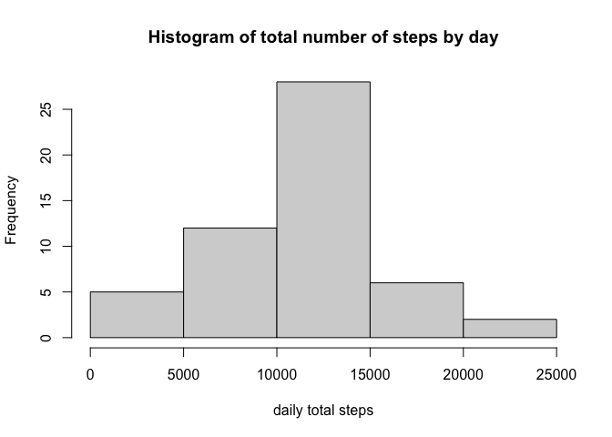
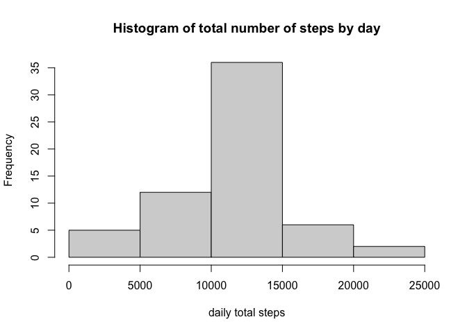
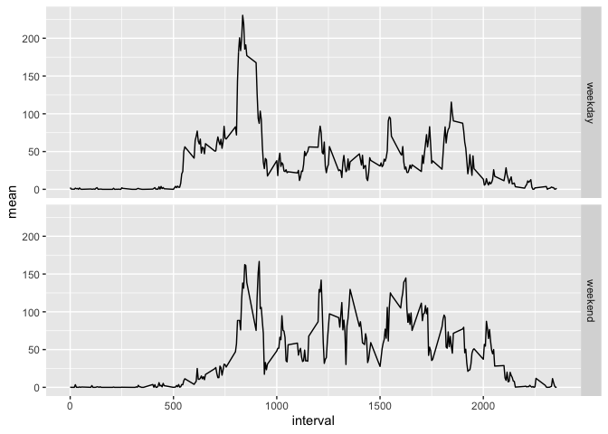

Author: FPrandini

## Loading and preprocessing the data

```r
#avoiding scientific notation
options(scipen = 999)
#setting wd
setwd("/Volumes/GoogleDrive/My Drive/JohnHopkinsDataScience/datasciencecoursera/5_REPDATA/1_assignment1/represearch_assign1/RepData_PeerAssessment1")
#first we will unzip the file
unzip("activity.zip")
#now let's load the file into r
activity <- read.csv("activity.csv")
#transform date filed from char into date format
activity$date <- as.Date(activity$date, format = "%Y-%m-%d")
```

## What is mean total number of steps taken per day?
This will consisist in 3 key steps:
1. Calculate the total number of steps taken per day

```r
library(dplyr)
```

```
## 
## Attaching package: 'dplyr'
```

```
## The following objects are masked from 'package:stats':
## 
##     filter, lag
```

```
## The following objects are masked from 'package:base':
## 
##     intersect, setdiff, setequal, union
```

```r
dailysteps <- activity %>% group_by(date) %>% summarise( totalsteps = sum(steps, na.rm = FALSE), .groups = "keep")
```
2. Make a histogram of the total number of steps taken each day

```r
hist(dailysteps$totalsteps, main = "Histogram of total number of steps by day", xlab = "daily total steps")
```

<!-- -->

3. Calculate and report the mean and median of the total number of steps taken per day

```r
meansteps <- mean(dailysteps$totalsteps, na.rm = TRUE)
mediansteps <- median(dailysteps$totalsteps, na.rm = TRUE)
```
The mean of daily steps is 10766.1886792 and the median daily steps is 10765


## What is the average daily activity pattern?
1. Make a time series plot of the 5-min interval and the average number of steps taken averaged across all days

```r
timeavg <- activity %>% group_by(interval) %>% summarise( mean = mean(steps, na.rm = TRUE), .groups = "keep") 
plot(timeavg$interval, timeavg$mean, type = "l", main = "Average steps per 5-min interval", ylab = "mean steps", xlab = "interval")
```

<!-- -->

2. Which 5-min interval, on average across all days, contains the max number of steps?

```r
timeavg <- timeavg %>% arrange(desc(mean))
winner <- as.integer(timeavg[1,1])
```
*The 5-min interval that has the maximum number of steps is* **835**


## Imputing missing values
1. Calculate and report the total number of missing values  

```r
print(paste("The number of NAs is", sum(is.na(activity$steps)), sep = " "))
```

```
## [1] "The number of NAs is 2304"
```
2. Devise a strategy for filling all of the missing values 
the mean of the interval across all days will be used to replace the NAs 
3. Create a new dataset that is equal to the original but treating NAs 

```r
activity_new <- activity;
for (i in 1:length(activity_new$steps))
{
    if (is.na(activity_new$steps[i]))
    {
        activity_new$steps[i] <- timeavg$mean[which(timeavg$interval==activity_new$interval[i])];
    }
}
rm(i)
```
4. Make a histogram of the total number of steps taken each day 

```r
dailysteps_new <- activity_new %>% group_by(date) %>% summarise( totalsteps = sum(steps, na.rm = FALSE), .groups = "keep")
hist(dailysteps_new$totalsteps, main = "Histogram of total number of steps by day", xlab = "daily total steps")
```

<!-- -->

4.1. Calculate the mean and median total number of steps per day 

```r
meansteps_new <- mean(dailysteps_new$totalsteps, na.rm = FALSE)
mediansteps_new <- median(dailysteps_new$totalsteps, na.rm = FALSE)
```

The mean of daily steps adjusting for NAs is 10766.1886792 and the median daily steps is 10766.1886792 

4.2. Do these values differ from the estimates form the fisrt part? 

```r
meanincrease <- ((meansteps_new / meansteps)*100)-100
medianincrease <- ((mediansteps_new / mediansteps)*100)-100
```

The mean of daily steps has increased 0% and the median daily steps increased 0.0110421% after adjusting for NAs


## Are there differences in activity patterns between weekdays and weekends? 
1. Create a new factor with 2 levels indicating wheter a given day is weekday or weekend 

```r
flag <- c("Saturday", "Sunday")
activity_new$weekday_flag <- ifelse(weekdays(activity_new$date) %in% flag, "weekend", "weekday" )
```

2. Make a panel plot containing a time series plot of the 5-min interval and the average number of steps taken, average across all weekday days or weekend days

```r
library(ggplot2)
timeavg_new <- activity_new %>% group_by(interval, weekday_flag) %>% summarise( mean = mean(steps, na.rm = TRUE), .groups = "keep") 
ggplot(timeavg_new, aes(interval, mean)) + geom_line() + facet_grid(weekday_flag ~ .) 
```

<!-- -->
